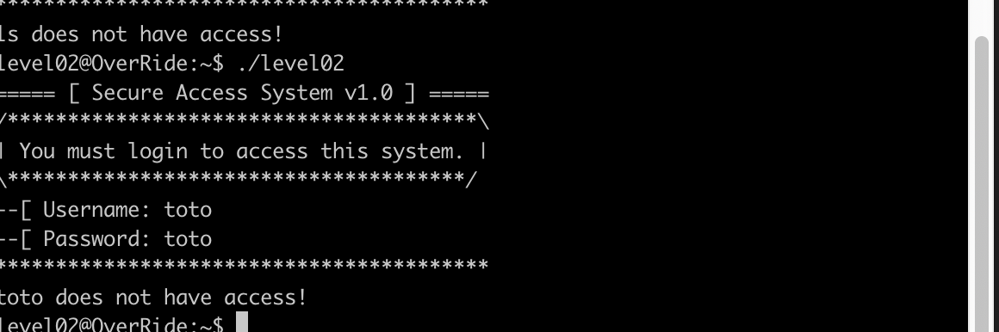

# Override / Level00

We have a compiler flag00 who is asking for a password:

Thanks to dogbolt we have the decompiler file.
Like we can see on the file souce we just need to put 5276 to bypass and access to the next level.
