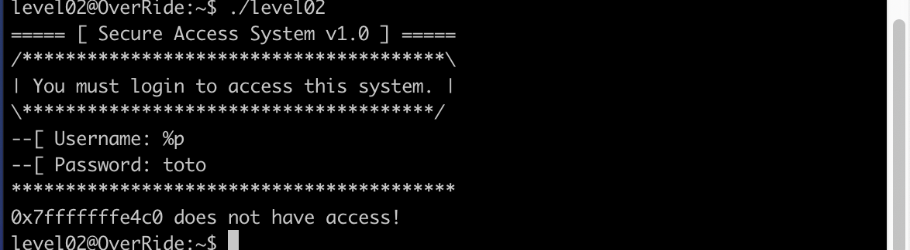
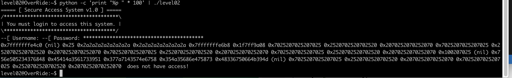

# Override / Level02

We have juste a exe level02.

We use again and always dogbolt to see the code source.
As we can see in the source file there are a printf(s) it s a vulnerability.

## How to exploit this ?

We know that s is the input for the prompt username.
So if we put %p (who print the contains of a variable) we can see an address.

So if we put a lot of %p can we see the variable ptr? (the variable who contains the password level03)
We know thanks to the source that's ptr is finish by null and had 40 caracteres. In the third line this looks the ptr.

`0x756e505234376848 0x45414a3561733951 0x377a7143574e6758 0x354a35686e475873 0x48336750664b394d (nil)`
We just need to ascii each segment and reverse it (because the computer always read in reverse so the pass is in reverse too).

I used cyber chef to do that ascii the segment and text reverse to reverse text.(Thanks obvious)

https://gchq.github.io/CyberChef/
https://www.textreverse.com/

We test it and that's works!! So this is the password.

## Final exploit

> python -c 'print "%p" * 100' | ./level02