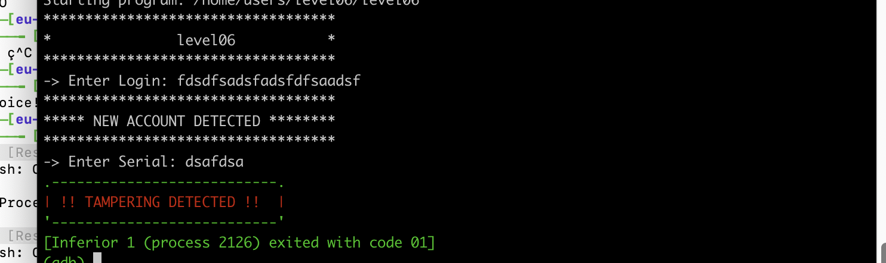
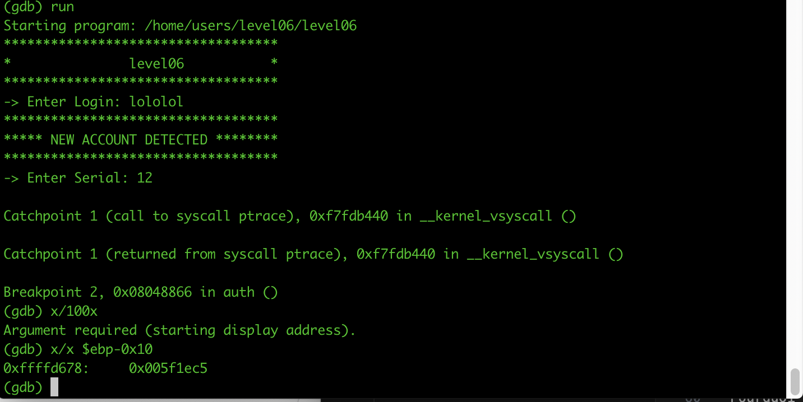
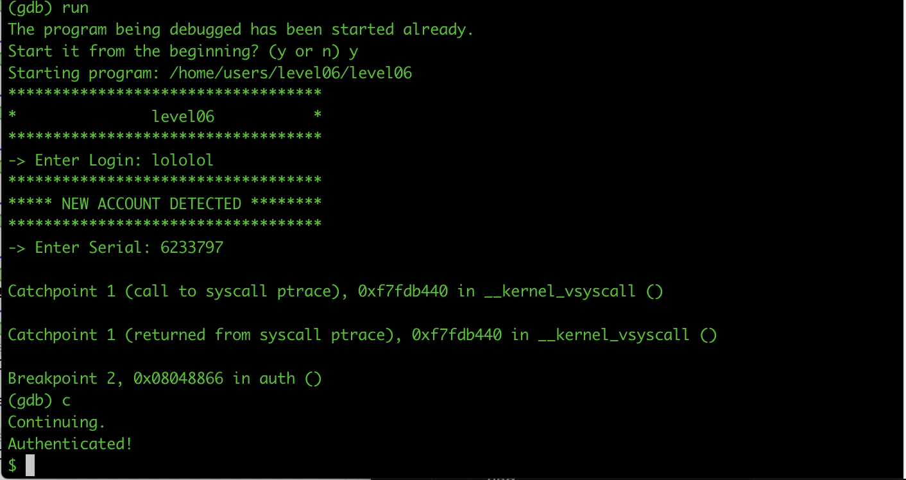

# Override - Level06

## Lire le fichier Level06

Pour cela on utilise Dogbolt.

## Vulnerabilite.

On peut voir cette ligne ci:

```
__isoc99_scanf(&unk_8048A60, &v4);
if ( auth(s, v4) )
  return 1;
puts("Authenticated!");
system("/bin/sh");
```

Donc on doit avoir un return 0 dans auth pour acceder au system(/bin/sh)

## 1ere difficulte.

On a dans source un ptrace qui nous bloque.



Cette fonctionnalite permet de bloquer un utilisateur de debugguer l'executable donc d'essayer de l'exploit.
Mais grace a cet article, j'ai pu le bypasse.
https://gist.github.com/poxyran/71a993d292eee10e95b4ff87066ea8f2

On doit juste break au moment de ptrace et de changer la variable avant la comparaison.

```
catch syscall ptrace
commands 1
set ($eax) = 0
continue
end
```

## 2eme difficulte

Dans source on peut voir que le premier argument qu on rentre definit le nombre qui doit etre compare pour bypasser.



Donc je dois mettre 0x005f1ec5 quand je rentre serial. (6233797)



Cela marche!
Maintenant le faire sur le terminal.

> (python -c 'print "lololol"'; python -c 'print "6233797"'; cat) | ./level06